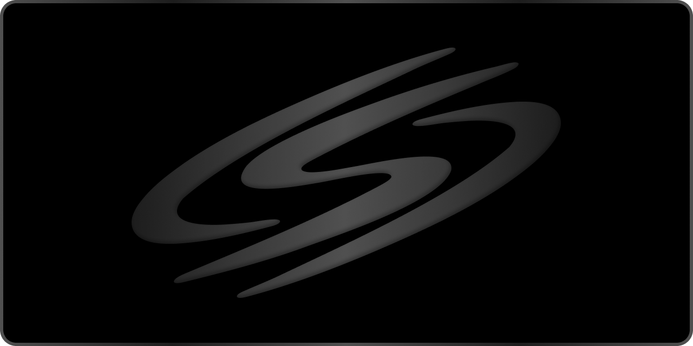

  

# SCARLET

**Минималистичный WireGuard-клиент для Windows (X64 & ARM64) в тёмном стиле iOS**

[Скачать](#-скачивание-и-установка) · [Преимущества](#-почему-scarlet-лучше-zapret-и-goodbyedpi) · [Поддержать проект](#-поддержите-проект) · [Инструкция](#-использование)

---

**SCARLET** – автономный, чистый и быстрый клиент для Windows, позволяющий в один клик подключать конфигурации WireGuard. Программа создана для восстановления стабильного доступа к заблокированным ресурсам (Discord, YouTube, Telegram) и оптимизирована для онлайн-игр с минимальным пингом.

> **Примечание:** Данный репозиторий является официальной страницей дистрибуции программы. SCARLET распространяется в виде готовых сборок для систем **X64** и **ARM64**.

---

## 🛡️ Почему SCARLET лучше Zapret и GoodbyeDPI?

| Параметр | Zapret / GoodbyeDPI | SCARLET |
| :--- | :--- | :--- |
| **Установка** | Сложная: ручной запуск консоли, батников (`.bat`) и подбор флагов | **В 1 клик:** запустил установщик и сразу пользуешься |
| **Внедрение в память** | ❌ **Да.** Использует хуки и драйвер WinDivert, перехватывающий пакеты в памяти | ✔️ **Нет.** Работает изолированно через стандартный драйвер Wintun от команды WireGuard |
| **Античиты игр** | ❌ Конфликтует с Vanguard (Valorant), Easy Anti-Cheat, вызывая бан или вылет | ✔️ **100% безопасно:** не триггерит защиту в играх |
| **Стабильность Windows** | ❌ Ошибки драйвера перехвата нередко вызывают синие экраны (BSOD) | ✔️ Стабильная фоновая служба без утечек памяти |
| **Discord и голосовые чаты** | ❌ Требует отдельных сложных настроек для работы голоса | ✔️ Звонки, стримы и голосовые каналы работают нативно |
| **Безопасность** | ❌ Неизвестные скрипты из разных источников | ✔️ **Чистый код без вирусов, скрытых майнеров и рекламы** |

---

## ⚙️ Как это устроено

* **Официальный стек WireGuard** – подключение осуществляется через виртуальный сетевой адаптер Wintun (разработка WireGuard LLC). Трафик изолирован и передается на максимальной скорости вашего тарифа.
* **Автономная служба `ScarletManager`** – соединение держит системная служба, поэтому VPN не прерывается при закрытии или сворачивании главного окна.
* **Живой мониторинг сети** – встроенный график отслеживает задержку (ping) в реальном времени каждые пару секунд с наглядной цветовой индикацией.
* **Интеллектуальный выбор** – кнопка «Лучший профиль» автоматически тестирует все ваши серверы и оставляет активным тот, у которого минимальный пинг.
* **Полная конфиденциальность** – программа не содержит аналитических трекеров, не собирает телеметрию и хранит все ваши данные локально в `%APPDATA%\Scarlet`.

---

> [!TIP]
> ### Поддержите проект
> Если SCARLET помогает вам оставаться на связи, комфортно играть и общаться, вы можете поддержать развитие проекта или просто поставить звездочку ⭐ этому репозиторию.
> 
> **Реквизиты для поддержки (кликните по адресу для копирования):**
> 
> | Валюта / Сеть | Адрес для перевода |
> | :--- | :--- |
> | **BTC** | `bc1qszpfg6cfwm8sqkp2ataz794ewpgetgnr50pqll` |
> | **ETH** | `0xe211e3a15Dab552126D3422CaC4ea6bb265f3117` |
> | **USDT (TRC-20)** | `TL4t7C41HUAZEjUUScFeWiXmxXkTLA7LsJ` |
> | **USDT (TON)** | `UQDsAstY3yK9QW8MPFZP2f2wlRcscdHXCJqWYznspl-g2kA4` |
> | **TON** | `UQDsAstY3yK9QW8MPFZP2f2wlRcscdHXCJqWYznspl-g2kA4` |
> | **SOL** | `ASKQsHuGsMXLnLBZpJvGh2SH6oHLLpM4hpgWSHvoj9CL` |

---

> [!CAUTION]
> ### ОСТОРОЖНО: ФЕЙКИ И КЛОНЫ
> SCARLET – полностью бесплатный проект. Единственная официальная страница проекта, где публикуются оригинальные сборки и обновления: **https://github.com/Sayziks/Scarlet**
> 
> Автор проекта не продает платные подписки. Любые другие сайты или каналы, предлагающие приобрести «платную/VIP версию» программы, являются мошенническими.

---

> [!WARNING]
> ### ПОЧЕМУ WINDOWS SMARTSCREEN МОЖЕТ ПРЕДУПРЕЖДАТЬ О ПРОГРАММЕ?
> Установочный файл программы пока не подписан платным коммерческим EV-сертификатом издателя. По этой причине фильтр Windows SmartScreen при первом запуске может отобразить окно «Неизвестный издатель».
> 
> **Это стандартная реакция Windows на новый софт:**
> 1. Нажмите кнопку **«Подробнее»**.
> 2. Выберите **«Выполнить в любом случае»**.
> Программа полностью безопасна, не содержит вредоносного кода и не модифицирует память других процессов.

---

## 📥 Использование

### 1. Скачивание
Перейдите в раздел **[Releases](https://github.com/Sayziks/Scarlet/releases/latest)** и скачайте версию под ваш процессор:
* **`Scarlet X64.exe`** – для стандартных ПК и ноутбуков (Intel / AMD).
* **`Scarlet ARM64.exe`** – для устройств на Windows on ARM.

### 2. Установка
Запустите установщик, подтвердите права администратора и нажмите **«Установить»**. Программа автоматически подготовит сетевую службу.

### 3. Добавление конфигураций
Нажмите в окне кнопку **«Добавить»** — откроется папка. Поместите туда файлы `.conf` (ваши WireGuard/AmneziaWG профили). Через пару секунд они появятся в списке.

### 4. Подключение
Выберите нужный профиль и нажмите **«Подключить»** (или воспользуйтесь кнопкой **«Лучший профиль»** для автоматического выбора самого быстрого сервера).

### 5. Управление через трей
При закрытии на крестик SCARLET сворачивается в трей возле часов, сохраняя активное подключение. Чтобы полностью выйти из программы, нажмите правой кнопкой мыши по значку в трее → **«Выход»**.

---

## 📄 Лицензия

Программа распространяется бесплатно на условиях закрытой лицензии Freeware EULA. Подробности см. в файле [LICENSE](LICENSE).  
Драйвер Wintun является разработкой проекта WireGuard LLC и используется в соответствии с условиями его лицензии.
